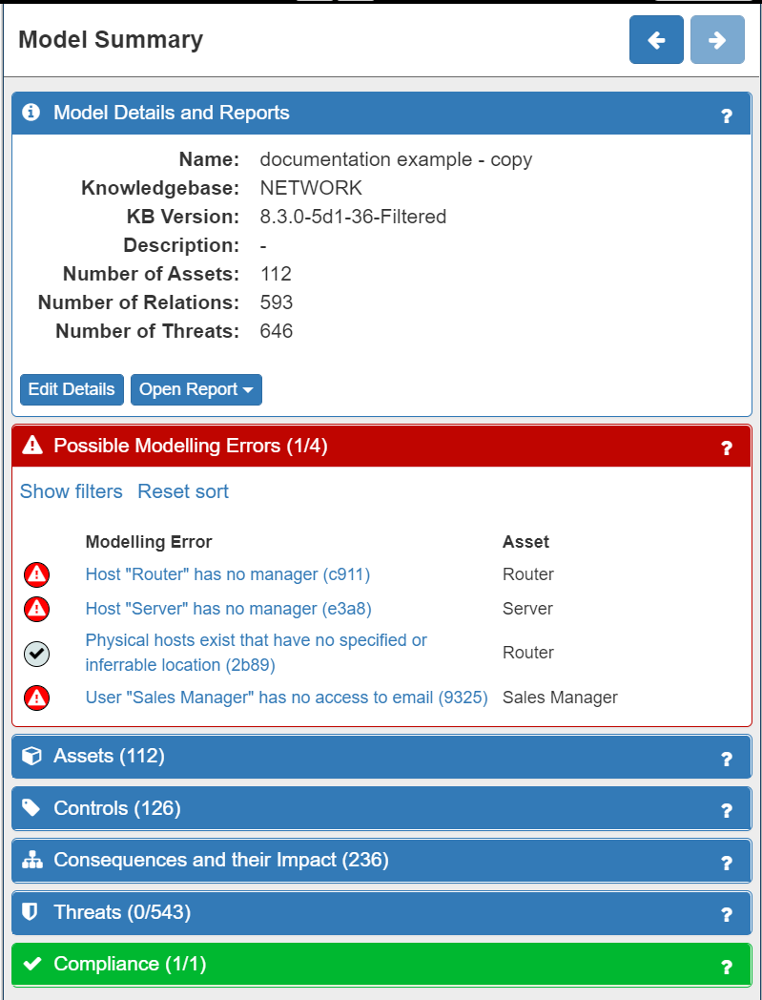

# Overview

The Spyderisk System Modeller (SSM) allows you to create a high level model of your system, to detect potential security threats, to assess the level of risk from each threat, and to find out and test what security controls could be used to reduce the level of risk in your system.
SSM allows you to model your current system and identify cybersecurity and compliance risks and the appropriate mitigations. It also allows you to model the reduction in risk resulting from the mitigations you will introduce in the future. In the same way, you can also model future changes to your system (e.g. adding a new cloud server, new database, new software applications, new sensors to a factory line, new staff, etc, to your system) and analyse how your cybersecurity and compliance risks will be changed as a result of that addition and what new mitigations you may need to implement. In other words, it is an iterative process.

To make best use of the SSM tool we suggest that you consider the **modelling and risk assessment process** as a series of stages that align with the ISO 27005 standard for cybersecurity risk assessment:

1. Getting started with SSM
2. Risk Identification - modelling your system (assets)
3. Risk Identification - completing your model (error correction)
4. Risk Analysis - setting impact levels, modelling existing controls
5. Risk Analysis - calculating the likelihood and risk levels
6. Risk Evaluation - evaluating threats (prioritising threats to treat and/or accept)
7. Risk Treatment - introducing controls / control strategies
8. Risk Acceptance, Communication & Monitoring - end/start of iterative process

**The tutorials available via the *Help* button will assist you with each of these stages.**

## In Brief...

### Risk Identification

Risk Identification encompasses the identification of assets, existing controls, vulnerabiliies, threats and consequences. ISO27005 describes an asset as *"anything that has value to an organisation and which therefore requires protection"* - these valuable assets are known as **Primary Assets**. So, the first stage of using SSM is to construct the model of your system by placing assets (e.g. servers, data, people, buildings…etc) onto the modelling canvas and creating links (relationships) between them. It will also be necessary to model many of the **Supporting Assets** as well. A simple, partially completed model can be seen below.

.png)

Next the model is automatically validated by SSM. The result of the validation is that any modelling errors will be identified and detaled information is provided to correct those errors. The **Possible Modelling Errors** panel can be seen below.

ISO27005 states that *“Asset identification should be performed at a suitable level of detail that provides sufficient information for the risk assessment”*. So the final part of Risk Identification is to adjust the model to accurately represent your system by adding in the existing cybersecurity controls that you already have in place. Existing controls can be described in the model with the **Control** class, using the *'in place'* attribute. Control types in our model include physical security (locks on doors), organisational measures (staff screening, training, policies), service security (TLS, AuthN, passwords, etc), data security, resource management and more. One or more Controls combine to form a Control Strategy. In addition, you should also tweak the Trustworthiness and Consequences/Impact levels for each asset to felect your specific business (or other) context. The Trustworthiness and Consequence/Impact levels for the Administrator asset can be seen below.

### Risk Analysis

Once your system has been modelled with sufficient detail, the next phase is to analyse the risk to your system. The Network Knowledgebase underpinning SSM contains a catalogue of generic threats along with the information necessary to identify when and where each type of threat is present in the System Model. In this way, **SSM automates the process by finding threats and calculating risk levels.** It also provides considerable information to support the second and third of these steps (Risk Analysis and Risk Evaluation). SSM enables you to see and understand the relationships between assets and threats as well as comprehend the **Consequences** to your system by knowing the **Likelihood and Impact levels** associated with all threats. SSM will also enable you to identify and understand any **GDPR compliance issues**, and their consequences, that you may have concerning the data flows within your system. These will be displayed to you in various panels on the right hand side of the screen and can be fully explored in considerable depth.

### Risk Evaluation

Once the various risks have been automatically analysed, you next evaluate the risks with their levels and determine which can be accepted as they are, and which need to be treated (in a prioritised list). SSM permits a user to mark a Threat as *'accepted'* (with an explanation), which is an evaluation you will need to make. We generally advise that you prioritise the **highest risk Consequences** (which are clearly shown in the interface) as a starting point.

### Risk Treatment

Beyond enabling you to identify, analyse and evaluate the risks to your system, SSM also suggests a vast **range of controls** that you might want to implement in order to reduce those risks. The options are to **modify, retain, avoid or share** each risk. SSM provides extensive help in proposing and applying controls to modify risks (by identifying the root cause(s) of Consequences and letting the user explore cause and effect paths through the system). SSM allows you to easily apply those controls, re-run the risk assessment, re-model if required, and clearly visualise the effect on the Consequences (Likelihood and Impact levels) of each threat and its associated control(s). SSM also allows you to produce reports from the data held in the model, including a **risk treatment plan** based on the Controls you have marked as *'to do'*.

### Risk Acceptance, Communication & Monitoring

Formally this stage is outside the scope of the SSM tool, as they are wider, business activities that form part of an on-going, iterative process.  Importantly though, despite this, the detailed model, the risk treatment plan and the selected controls to implement will support you in your internal budget, resources and implementation discussions, make on-going monitoring simpler, and help the directors reach an informed, collective agreement on an acceptable level of risk versus investment in cybersecurity.
