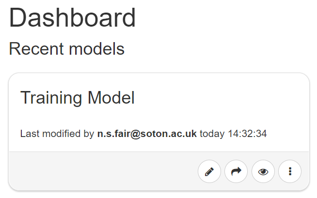
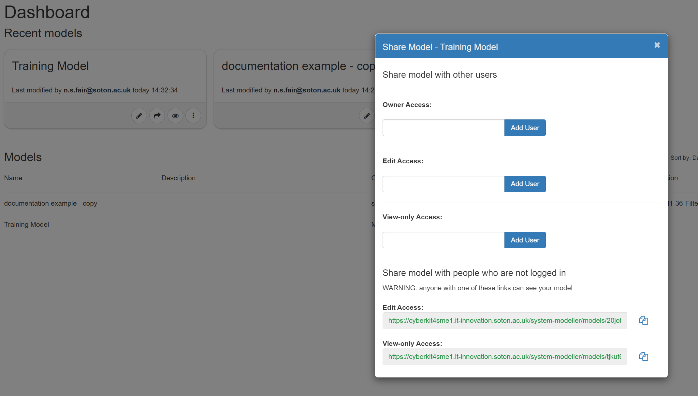

# Getting Started with SSM

## Creating A New Model

This is the Spyderisk System Modeller Dashboard.
.png)
To create a new model, click on the **Create New Model** button. You will be asked to name the model (it is entirely your choice what to call it) and to select the underpinning knowledgebase from the **Knowledgebase** drop-down list provided (note, this choice only appears if more than one is available). The knowledgebase is important as it tells the tool what set of relationships to apply when you start modelling your system and what threats to analyse when you validate your model. When you are happy with the name and the knowledgebase, click the Create New Model button and you will move to the modelling canvas and can start building your new model.

## Editing or Viewing an Existing Model

When you return to the Dashboard your model will be listed in the Models list and as a tile in the Recent models secton. All models can be edited by clicking on the **pencil icon** or viewed by clicking on the **eye icon** on the tile and can be accessed by hovering over the desired entry in the Models list and selecting the icons from there.

## Sharing an Existing Model

To share a model with colleagues, click on the **arrow icon** to open the Share Model dialogue box. You can set your sharing permissions here and/or use the links provided to share with those who are not logged in.

## Additonal Model Options

To edit or view the model in a new tab or to access a range of further model options, click on any of the **three dots icons**.
.png)

The additional options include:

* **Edit Details** - To edit the model name and description
* **Export Full Model** - To export the model in full
* **Export Assets Only** - To export only the asserted assets and relationships
* **Copy Model** - Useful for versioning
* **Delete** - To remove the model from the dashboard entirely

## Importing an Existing Model

The Import operation allows you to upload a previously saved model into SSM – just click the **Import Existing Model** button on the Dashboard. A dialog box will appear and you will be asked to Browse for and Select the file to import.
.png)

You will be given a number of import options including:

* **Import asserted facts only?** - *NOTE:* to import just the asserted assets, relations...etc
* **Overwrite existing model? (Cannot be undone! Make sure to take a backup!)** - *NOTE:* attempting to import the same model without this being checked will result in an error
* **New Name?** - *NOTE:* do this to rename an existing model to avoid overwrite failures.
If none of the import options are selected the file will be imported as is and in full.

## Summary

Now that you know the basics of creating, editing and importing models, it is time to move on to Risk Identification part 1.