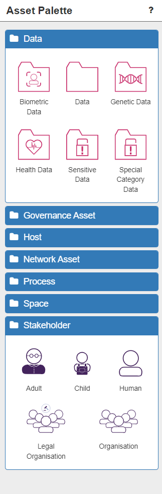

# Risk Identification (1) - Modelling your System

## General Modelling

Once you have opened a new model from the dashboard and accessed it, you will be presented with the **Model Construction Canvas**. This is the empty area of white in the middle of the screen. When you start modelling for the first time it is literally a 'blank canvas'. The canvas is where you will build the model of your system.

.png)

### Assets

Your model consists of the physical objects (including data) that make up your system. These are called **assets** and are represented as nodes in the model. Assets can be found listed in the Asset Palette on the left of the screen, under various 'types' (two of which are expanded in the image below).

When modelling, it can help to imagine the canvas (and the Assets) as divided into three broad areas:

* The Application Layer (data and processes) – Data, Process
* The Network Layer (sensors, IOT, devices and network connections) - Network Asset
* The Physical Layer (spaces, places, people and jurisdictions) – Governance Asset, Space, Stakeholder

.png)

To begin building the model, select the chosen asset from the palette and drag-and-drop it onto the canvas. You can double-click on the asset text to rename the asset.

**Modelling Tip: Immediately renaming assets to names you can easily recognise and understand is a very good idea.**
**Modelling Tip: It is recommended that you start with Assets in the Application Layer and work down through the Network Layer to the Physical Layer.**

You can click on an asset on the canvas at any time. The selected asset will highlight with a green border. Once selected, a wide range of details about that asset will be displayed in the panel on the right:

* Asset Details and Population.
* Additional Properties (used when integrating with other tools)
* Trustworthiness (i.e. how much various aspects of this asset can be relied upon)
* Inferred Assets (additional assets inferred by the software which are located here after validation)
* Incoming relations
* Outgoing relations
* Controls (empty until the model has been validated)
* Control Strategies (empty until the model has been validated)
* Consequences and their Impact (empty until the model has been validated)
* Threats (empty until the model has been validated)

.png)

Assets can be deselected by clicking anywhere on the canvas. They can be deleted at any point by clicking on the red dustbin icon on the asset, which appears on hover-over. All relationships from/to that asset will also be automatically deleted.

#### Primary & Supporting Assets

ISO 27005 suggests that there are **primary assets** and **supporting assets**. Primary assets are in some sense critical to the business and fall into two general categories:

1. business processes and activities
2. information

Later in these tutorials you will discover how to identify the subset of these primary asset types and how to assign some value (importance) to them through adjusting the default Impact levels for Consequences arising from threats to this asset (see Risk Identification pt.3 - Adjusting your Model).

### Relationships

Once you have two or more assets on the canvas you need to connect them together with a **relationship**. Relationships are represented as links in the network model you are constructing.

**Modelling Tip: It does not matter which asset you start with when connecting two assets.**

To connect two assets, hover over the first asset and click the green cross in the top left corner.

.png)

Next, permitted assets will display a blue tick in the top left corner. If this tick is not present it is not possible to connect those two assets. Click on the permitted destination asset that you want to create the relationship with. At this stage one of two possibilities will occur:

1. A connecting arrow with a relationship label will be automatically drawn on the canvas - *NOTE:* this only happens when there is only 1 possible relationship between those assets. *NOTE:* the arrow indicates the direction of the relationship.
2. The **Select Relation** dialogue box will open and you will choose the correct relationship from the list presented. Hovering over a relationship option will display a description of that relationship to help you choose correctly (see image below).

.png)

Once the relationship is automatically or manually chosen, it will be drawn on the canvas.

.png)

Right clicking on any relationship arrow or label will bring up information and options for that relationship.

.png)

**To demonstrate SSM in action, we will now start building a simple example model. Of course, your model is likely to be considerably more complex and much larger.**

## Application Layer

The Application Layer consists of Data assets and Process assets, both of which can have Humans associated with them.

### The Importance of Databases, Processes & Data

There are a number of commonly associated assets (and the relationships between them). Normally, these are self-evident, or will be detailed in the modelling errors after model validation (enabling you to correct them easily - see Risk Identification pt.2 - Completeing your Model).

However, lets explore one common example here.

*NOTE:* the server is a hardware asset (and is NOT in the Application Layer).

Running on the server are two **application processes**:

* the *database* (a specialised application process with its own asset icon 'DB')
* the *web server* (a generic, renamed 'application process' icon)

All generic application processes are assets which execute software processes in real-time (i.e. in memory, running now).
Database assets are specialised applications for serving data (i.e. a MySQL process).
*Neither* of these application processes are the data itself. This needs to be represented by (one of) the data icon(s) as a separate node in the system.

Hence a very common asset-relationship path would be **Server-hosts-Database-serves-Data**

**Modelling Tip: It is very easy to think that a Database is the actual data - it is NOT, it is the *process* which serves the data**

Importantly, the relationships between processes and data form the foundation of the ISO 27005 Standards and have therefore been very carefully defined within the SSM Knowledgebase.

This means there are 7 possible relationships between any process and any data for you to select. Hovering over one of the options displays information about what that relationship specifically involves:

* **amends** - the process uses and alters the value of an Instance of Data, and is not blocked if it cannot access the data
* **apends** - the process creates new Instances of Data, adding them to a collection but not overwriting existing instances. This is a type of update operation, but the Process does not need access to the previious values.
* **creates** - the process creates the value of the Data, and does not require access to it after that
* **reads** - the process uses the Data values without altering them, and is blocked if it cannot access the Data
* **receives** - the process uses the Data values without altering them, and is NOT blocked if it cannot access the Data
* **serves** - the process provides access to the Data for other processes, but does not make use of the Data for itself
* **updates** - the process uses and alters the value of the Data, and is blocked if it cannot access the Data

.png)

**Modelling Tip: It is very important that you understand and correctly model the relationships between the processes and the data in your system**

### Associated Humans

Human interaction with data and processes is a critical point-of-weakness in the security of any system as humans can be phished, make mistakes, misunderstand or deliberately sabotage systems – intentionally or accidentally. So humans in the system must be modelled by the same drag-n-drop method used for the other assets.

**Modelling Tip: Human assets represent *user roles* in a system (not specific individuals).**

There are 5 different relationships a Human can have with Data:

* **amends** - the relationship between an interactive process user and data they *enter, review and update* by using the process
* **enters** - the relationship between an interactive process user and data they *enter* by using the process
* **views** - the relationship between an interactive process user and data they *view* by using the process
* **hasController** - the stakeholder is legally responsible for use of the Data to both the data subject and the data regulator (GDPR compliance)
* **relatesTo** - a relationship between a personal device (inc. IoT devices) and data and a Human user. Data on the device may be Personally Identifiable Information (PII) related to that user

.png)

There are also 3 different relationships a Human can have with a Process:

* **interactsWith** - the human is an interactive user of the related Host or Process
* **manages** - the human manages (administers and configures) the related Host or Process, and the otherwise unmanaged processes running on it, or otherwise unmanaged hosts within a Space
* **operates** - the stakeholder is the legal entity responsible for managing the Host, Process or DataCentre

.png)

#### Application Layer Modelling Summary

In the example model we are building, the Sales Manager also interacts with the Customer Data, but not directly, rather through a series of processes. She does by interacting with a Web Browser process which uses the Web Server to update the Customer Data, thereby also using the Database.

.png)

The Application Layer for our simple example model is now complete (remember that Server 1 is NOT in this layer). In other words, we have added the **data, process and associated human assets** to the canvas (in the appropriate place) and linked them all with the right relationships.

## Network Layer

Next we move to the Network Layer which consists of **Network Components, Devices (inc. IoT devices) and Sensors** - in otherwords the physical network through which data is generated, stored, communicated, and used.
This part of the system consists of:

* **Hosts** - devices (physical and virtual), sensors (including IoT), servers, networking infrastructure (routers). *NOTE:* We have already seen the first of these modelled - the Server 1 asset and its relationships to the Processes and Data in the Application Layer.
* **LogicalSubnets** - the sub-networks in the system that enable communication between devices (e.g. LANs, WiFi networks, the Internet)

### Hosts

Hosts are the physical (and sometimes virtual) devices on which data is permanently stored and processes are run. Hosts are closely related to the Application Layer because they represent the means to store and exchange data and run processes. This is modelled using two relationships:

* **hosts** - a Process running on a Host
* **stores** - a persistent copy of Data held on a Host

In our example model, Server 1 **hosts** the Database and the Web Server processes and **stores** the Data. This is not the only Host in our example system, but we will return to the others after learning about LogicalSubnets...

### Sensors and Internet of Things Devices

IoT assets represent a device with its own embedded Process and Data, so it can be used by Processes in the Application Layer, but also be *connectedTo* subnets in the Network Layer. The IoT device itself may be a Sensor which creates and serves measurement Data so other Processes can access it, or an Actuator which serves control input Data so other Processes can alter it.

IoT devices can be thought of as part of the Application Layer, only with a built-in ability to connect to networks. However, the reason IoT assets are modelled in the Network Layer is that they are most frequently physical objects (devices), and to model them as such seems less confusing.

In our example there are no IoT or sensors in the system, but in a different context, such as manufacturing business, there are likely to be many factory-floor / assembly line sensors and other types of monitors or IoT devices present. You can model a range of Sensor, Smartwatch and Health Sensor (e.g. wearables such as FitBits...etc) assets using the icons in the **Host Palette**, rename them as appropriate, and link them up in the Network Layer as usual.

.png)

### Additional Hosts

#### Logical Subnets

Logical Subnets are the sub-networks which are present in your system, such as **WiFi networks** and **Local Area Networks** (LANs).

The **Internet** is a special type of LogicalSubnet which represents the global public network. It is treated as one big locally connected segment so that we don’t need to model explicitly its huge scale and complexity. This is represented by the Internet asset icon. There are two main relationships between Hosts and LogicalSubnet components:

* **connectedTo** - the Host (or DataCentre) can send and receive messages via this LogicalSubnet component
* **providedBy** - the communication enabled by the LogicalSubnet component is provided by this Host (inc. network allocation, address translation for routing ot other subnets, and support for EAP authentication)

#### Network Layer Modelling Summary

Hence, to finishing building the Network Layer of our example model, we need to add the remaining Hosts and the Logical Subnets by **thinking about the detail** of the Network Layer of the system. LogicalSubnet icons can be found in the **Network Asset** palette.

Fisrtly, the Sales Manager uses (*interactsWith*) a Laptop (a Host), which is *connectedTo* the Wifi network (a LogicalSubnet component) and *hosts* the Web Browser (a Process).

.png)

Secondly, the Wifi is *providedBy* the Router (a Host), which is also *connectedTo* the Internet (a public network). The Router also provides a Wired Local Area Network (LAN) which Server 1 (a Host) is *connectedTo*. So the example model now looks like this:

In simple network terms, the Server is wired into the Router in order to access the Internet, while the Laptop accesses the Internet remotely via WiFi, which is also provided by the Router. This consititutes quite a common pattern of assets and relationships in the Network Layer, especially when modelling Internet access.

**Modelling Tip: Whenever/wherever your system is exposed to the Internet your security risks increase considerably, so it is very important to model all Internet connected devices correctly.**

The Network Layer for our simple example model is now complete. In other words, we have added the **hosts, logical subnets and any sensors/IoT devices** to the canvas (in the appropriate place) and linked them all with the right relationships.

## The Physical Layer

The final area of the canvas to consider is the Physical Layer, which consists of **Spaces, Stakeholders and Governance**. These are the people, places, and location-based laws and regulations which impact your system, which can all be found in the Asset Palette:

### Spaces

The other main way in which your system could be attacked is physically, and if this is considered important, you should model the physical locations of network devices.

There are four broad types of space:

* **PublicSpace**: an open physical space that anyone can access, lacking even a defined boundary so it cannot be patrolled or inspected (e.g. a public street or (more abstractly) a town or country)
* **Bounded Space**: a public space with a boundary so it can feasibly be checked or inspected. The boundary may be a physical perimeter (e.g. a public building), or non-physical (e.g. a region within an open space whose boundary is specified on a map). Access to these spaces cannot be restricted
* **PrivateSpace**: a bounded physical space where access can be restricted and secured (e.g. a private home, a business premises, a hospital ward, etc)
* **DataCentre**: a special type of PrivateSpace (usually a private building) that contains host and network assets that are not modelled explicitly, but is itself connected to other networks, and which is used to support cloud-platform-based virtualised hosts and networks.

### Stakeholders

Another huge potential weakness in your system results from the humans in that system. We have already seen that humans can have relationships with data and processes (Application Layer) and with physical hosts (Network Layer), but, along with organisations, they also play an important role in the Physical Layer. Hosts are managed by humans acting in system admin roles, or for personal devices, in a user role. Organisations control access to Private Spaces, and operate DataCentres, Hosts and Processes so, for example, an Organisation is the operator of a DataCentre or Host if the Human managing it works for the Organisation.

**Modelling Tip: SSM will automatically infer as many of these Human or Organisation responsibilities as possible. For example, if a Human manages a Space, SSM will infer they also manage all Hosts within that Space, unless an alternative maanager is explicitly defined.**

There are five main types of Stakeholder:

* **Adult**: a legally competent human able to give their informed consent for any process resulting from their participation in the system
* **Child**: a human below the age-of-consent
* **Human**: an individual who *uses / interactsWith* or *manages* assets
* **Legal Organisation**: a group of humans working together that has been consituted as a legal entity (e.g. a limited company, a charity, a government...etc)
* **Organisation**: a group of humans working together which is not a registered legal entity with similar legal status to an individual (e.g. a loose federation, a social group....etc)

### Governance Asset

The final element of the Physical Layer relates to governance (and compliance) risks. The ability to assess GDPR compliance, in particular, is is an additional feature of the SSM tool, and is represented by the **Jurisdiction** asset. It is necessary to model Jurisdictions, particularly if your system includes personal data (such as Customer Name Data) which is subject to GDPR in some countries/regions. Because different countries/regions have differing laws concerning data and IT infrastructure, which can result in compliance threats to your system, it is only necessary to model multiple Jurisdictions if your system crosses multiple Jurisdictions, for example if your system spans the European Union and the United States.

#### Physical Layer Modelling Summary

Hence, to finishing building our example model, we need to add the people / organisations relating to the system, and indicate the locations of the Hosts we have already modelled in the Network Layer, as well as include some jurisdiction information.

In the case of our example model, this means that we need to indicate the location of the Server, the Router and the Sales Manager's Laptop - all of which are permanently kept within the Company's offices. The company offices are a secure, access-controlled, private space.
*NOTE:* Clearly, a laptop is a mobile device able to leave the company's offices, but for the sake of simplicity at this stage, we shall imagine that it never goes anywhere outside the secure office complex.
So now our system model looks like this:

.png)

Next, we need to consider the people involved. The Company Premises is managed by the company Administrator, who works for Company (X), which is a legal entity. Importantly, as we are now modelling the Administrator into the system, we must also include the Hosts with which they interact - in this case, a Workstation (desktop computer), also located in the company offices and connected to the WiFi network.
Finally, the system we are modelling is within a single country that falls under European Union jurisdiction (in other words is subject to GDPR requirements). Adding these assets means our example model now looks like this:

.png)

## Conclusion

In this Risk Identification Part 1 tutorial, we have learnt:

* the basic principles of modelling a system using assets and relationships
* the basic division of the canvas into 3 Layers (*NOTE:* you do NOT have to follow this layout, however, experience has shown us that it can help to do so)
* how to build a simple model of an example system

.png)

You are now ready to progress to the next stage of Risk Identification - validating the model - in the following tutorial.
