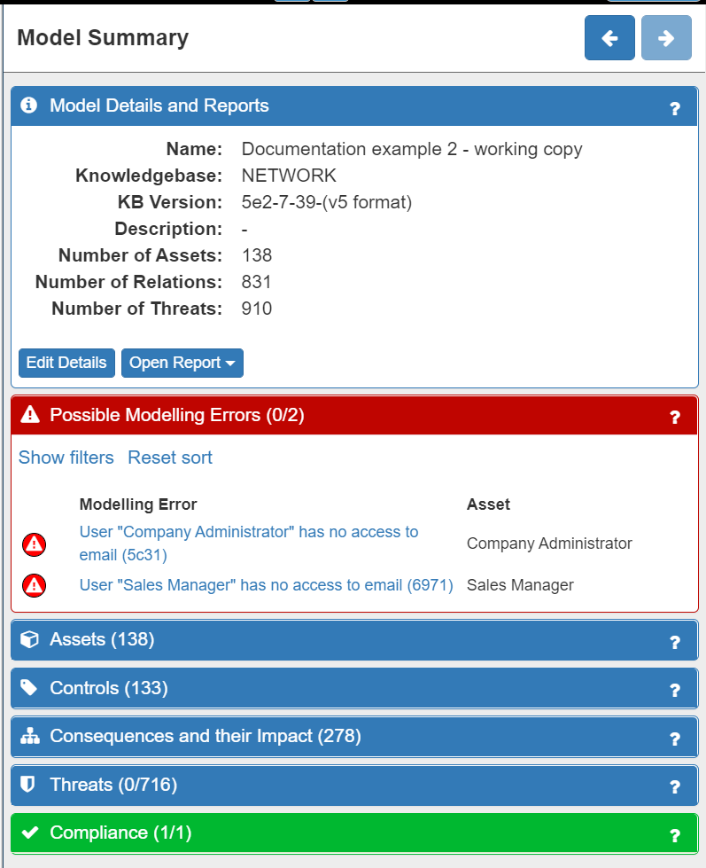
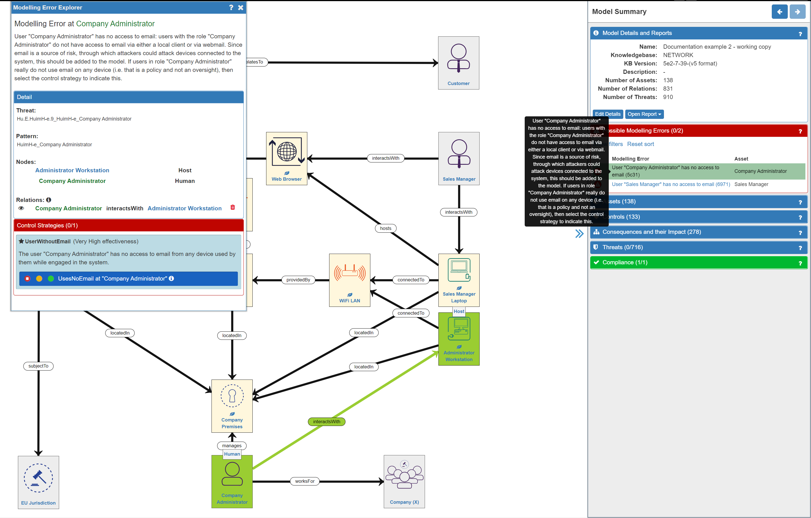

# Risk Identification (2) - Validating your Model

## Validating your Model

After you have built your network model you will need to validate the model. This means that the SSM tool will check that all your assets and relationships are valid, calculate the threats and misbehaviours applicable to your system in your domain, set default Impact levels and conduct other calculations.

In other words this is when all the clever stuff under the hood occurs – hence validation can take a few moments to complete, please be patient.

To do validate your system, just click on the red ‘play’ button…

.png)

…which will turn green and display a confirmation once validation is complete.

.png)

**Validation Tip: every time you add/remove assets/relationships from the model you must re-validate the model – look out for the red ‘play’ button reappearing!**

## Resolving Modelling Errors

It is quite likely that you will find some modelling errors, especially while learning how to use SSM. Don’t worry!

After validating your model, the first thing to do is to check the Model Summary panel on the right of the screen. If the **Possible Modelling Errors** and/or the **Compliance** tabs are showing red then there is a modelling and/or compliance error (the number of errors is also displayed). Modelling errors refer to potentially missing or incorrect assets or relationships in the model, while Compliance errors highlight areas of the model that do not comply with GDPR.

.png)

Clicking on the relevant tab will expand the panel where the modelling / compliance errors will be displayed:

Clicking on an individual error will provide detail and an explanation of the error in three ways:

* on the canvas (affected assets are highlighted in green)
* as a tool tip description
* in the **Modelling Errors Explorer panel**

In the Modelling Errors Explorer panel the description is repeated, the detail of the affected assets is provided, and a control strategy option may be available.

In our example system model, there are no Compliance errors and two Modelling errors. The Modelling errors indicate that we have forgotten to include the email access that both the Administrator and the Sales Manager have. This is highlighted as having an email client is very common and it is also a source of many threats. It can be resolved in two ways:

* by adding an email client and the necessary relationships to the model for each person
* by using the **Control Strategies** option to tell the model that neither person uses email - this is done by selecting the green 'trafic light' option:

However, using the Control Strategies option would not be an accurate reflection of the system, as both people do use an email client, so it is better to add the email clients into the model, as a Process in the Application Layer. In this case, the email clients are *hosted* on the respective devices that the Administrator and Sales Manager use - so we need to include this relationship. Also, we need to establish an *interactsWith* relationship between the person and the email client. So now our model looks like this:

.png)

**Remember: as we have made changes to the model we will now need to run the model validation process again**

Doing so will now result in model without either Modelling or Compliance errors - in other words, a fully functioning model. This will be indicated by the Modelling Errors tab turning green:

.png)

## Summary

Once you are happy that you have modelled your system, you then run the validation process and resolve any errors. This may be an iterative process that needs to be repeated several times. When the model has no further errors you are ready to start refining your model to better reflect the reality of your real-world context.
