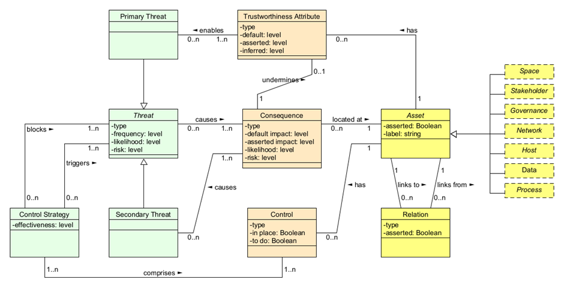
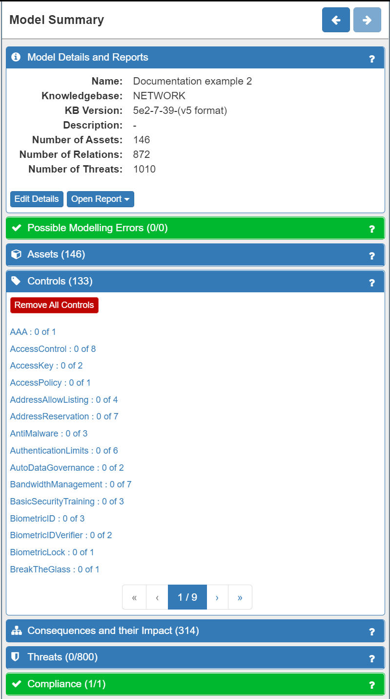
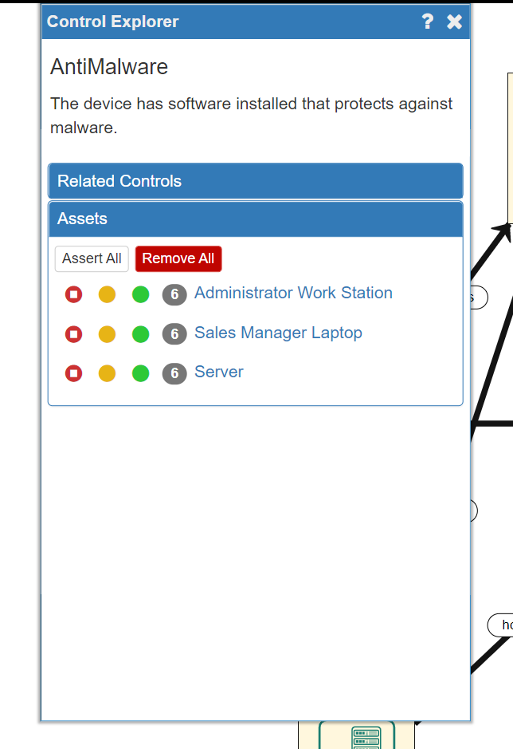
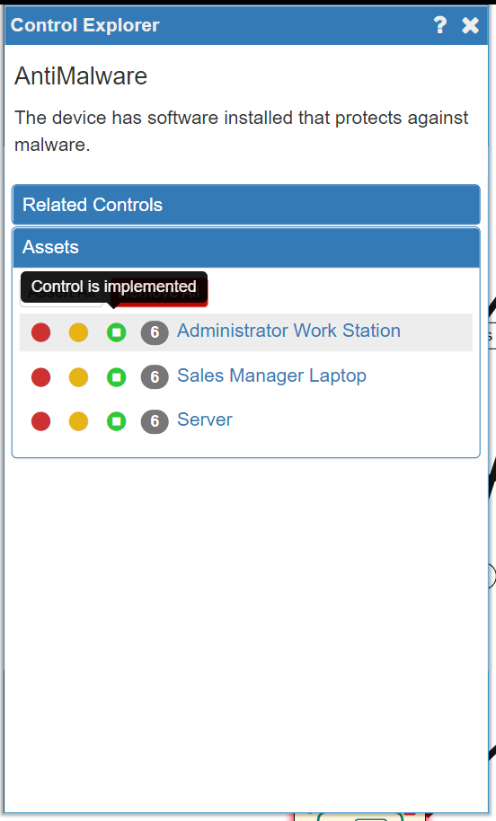
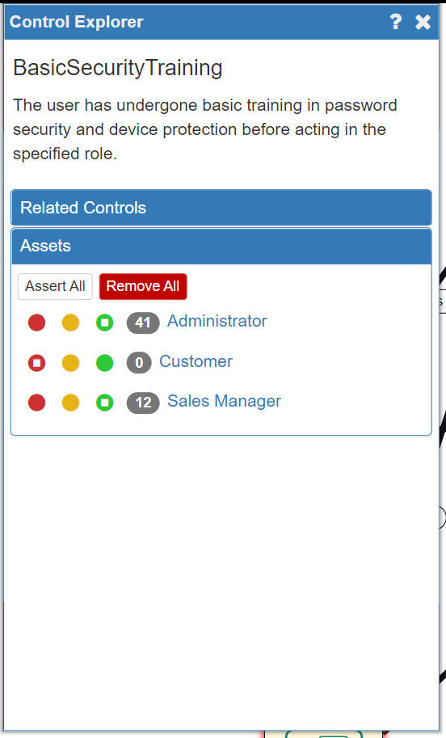

# Risk Analysis (1)

## Adjusting Your Model

Now that the model is correct it is time to refine and adjust the model to accurately reflect the reality of your business context. Because your business context is unique to you, SSM allows you to reflect this in two ways:

* adjusting the **Impact Levels** for the assets in your system
* including any existing security measures, or **controls**, that are in your system already

### The Core SSM Concepts: Trustworthiness, Threats, Consequences, Impact and Controls

It is worth taking a moment to understand some of the core concepts and terminology used by the SSM tool, as it will help you to understand what you are seeing/doing and why you are seeing/doing it. The relationships between these concepts are summarised in the diagram below:

In accordance with ISO 27005 standards, the SSM tool models assets in terms of Trustworthiness, Threats, Consequences, Impact and Controls.
The **Trustworthiness** of an asset is how much that asset can be relied upon to function correctly. Each asset is automatically assigned a various Trustworthiness levels and at this stage there is no need to change the default settings.

SSM also automatically identifies the **Primary** and **Secondary Threats** and their **Consequences** in relation to an individual asset.
Threats cause Consequences at Assets which themselves almost always undermine a Trustworthiness Attribute at the Asset. A Secondary Threat is the inevitable consequence of another Threat (so loss of availability of a host would inevitably cause loss of availability of any data it stored) and so is directly "caused by" a Consequence. A Primary Threat is an event (accidental, or more often deliberate) and made more likely by a lowered Trustworthiness Attribute. In this way a complex interlinked chain of Threat-Consequence-Threat is modelled demonstrating how an attacker (or just accidental or inevitable problems) propagate through the system.

Next, if a Threat and its Consequences happen, there will be a negative **Impact** on your business of varying degree. Consequently, SSM will automatically assign a default Impact Level for each asset in your model.

SSM will also recommend a range of security **Controls** to mitigate against the threats identified.

The Consequences of a Threat will also have an **Impact** on your business. In this example, losing customer data is likely to negatively impact your business in important ways, for example, through the loss of reputation and therefore the loss of future (and existing) customers. As a result, SSM will suggest a range of security measures, known as **Controls**, that you can implement to reduce the likelihood or even block the Threats from occuring. In some cases though, the introduction of a Control can also trigger another Threat. For example, introducing password protection on the customer data introduces the Threat that the Sales Manager may forget her password, with the Consequence that she may suffer a *Loss of Availability* of that data (and any potential secondary threats that may cause).

In short, SSM conceptualises cyersecurity risk in the following way:

* Assets have a set of Trustworthiness ratings (how reliable they are in various ways), but can also be subject to Threats (Primary or Secondary)
* Threats have Consequences (and Consequences can also cause more Threats)
* Consequences have a negative Impact on a business of varying degrees (very low to very high)
* Threats can be mitigated by implementing security Controls (but some controls can cause more Threats and Consequences)

### Setting Impact Levels

Although SSM simplifies and speeds up the risk analysis process by automatically assigning default Trustworthiness and Impact levels to the assets in your model, in accordance with ISO 27005 standards, you should nevertheless identify the **Primary** assets in your model: critical data and critical business processes. some of your **Data** assets may be critical to the business and the Impact levels for the various Consequences on those data assets should be carefully chosen. The software does not model business processes but often these are best represented by an **Application Process**. Again, the critical ones should be examined carefully and their Impact levels set.

The other assets in the model will (most probably) have the correct default settings. It is not necessary to consider knock-on effects as this is done automatically. For instance, if the availability of a dataset is critical to your business then the Impact level for "Loss of Availability" on that data asset should be elevated. It is not necessary though to elevate the "Loss of Availability" Impact level of the **Host** that hosts the data as this will automatically be taken into account.

To set the **Impact Levels** for a Data asset you will need to click on the asset in the model and then choose the Impact Level for each Consequence.
To do this:

* Firstly, click on any asset. The asset will now have a green border. (**NOTE: click anywhere on the canvas to deselect an asset**). The Model Explorer Panel on the right of the screen will change to display the Asset Panel. The **Consequences and their Impact** tab will automatically be displayed, along with the number of possible Consequences attached to this asset shown in brackets. In this example the **Customer Data** asset is selected and has six Consequences:

.png)

* Secondly, click on an individual Consequence to open the **Consequences Explorer panel** where considerable detail is provided:

.png)

* Thirdly, adjust the **Impact Level** in either the Consequence Explorer panel or under the Consequences and their Impact tab in the Customer data panel (it doesn't matter which) to accurately reflect the Impact on your business in your particular context. There are five levels to choose from as follows:

.png)

In this example, the Loss of Confidentiality of Customer Data will have significant effects on your business (potential for fines, compenstation payments, loss of reputation and trust, loss of customers...etc). However, once quickly addressed, it need not be fatal to your business. Therefore, an Impact Level of **High** is most appropriate:

.png)

* Finally, repeat the process with the remaining Consequences for the asset.

.png)

**NOTE: As the Risk Analyst you know your system and your business better than anyone else, so it is your decision concerning what Impact Level to choose for each Consequence**

Now, you will have adjusted your model to most accurately reflect the realities of your business context in relation to the Impact of the Consequences of Threats for your most important business assets.

### Adding Existing Controls

The next thing to do is to model any existing security Controls that you may already have in your system. Again, this is an important step as it will greatly improve the accuracy of the risk analysis and the recommended Controls. It is done using the **Controls** tab on the **Model Summary** panel:

Listed under the Controls tab are a wide range of possible security controls that may be in place already relating to technical, physical and human aspects of your system. Clicking on an individual control will open the **Control Explorer** where a description of the Control can be found as well as the Assets to which that Control can be applied. A *traffic light* system of red, orange and green 'lights' can be seen next to each applicable node:

* A red light = Control **not** implemented
* An orange light = Control is planned to be implemented (but is not yet in place)
* A green light = Control **is** already implemented

SSM defaults to no Controls already existing (all red lights). Choosing the orange light will cause the SSM to take it into account in the risk level calculation (as if the Control is in place) but the fact that it is not implemented yet will be highlighted in the reporting.

**NOTE: As the Risk Analyst you should review the default setting for each Control and each Asset it impacts at this stage using your knowledge of your system**

In our example system **AntiMalware** software is already installed on all the company's devices, so we will need to change all three of the assets to a green light:

The available Controls are not only software-based, but also relate to physical security Controls (e.g. Biometric locks on Server rooms, etc) and to human security Controls (e.g. mandatory security training programmes). In the example system, all staff have undergone **Basic Security Training**, so we will add this to the relevant human Assets in the model now:

Note that the Customer is not an asset under our control in this scenario so we should not asssert that they have any training.

Repeat this process until you are satisfied that the existing Controls within your system have been successfully modelled.

### Summary

We have understood the **core concepts of Trustworthiness, Threats, Consequences, Impact and Controls** on which the SSM tool is built, and explored how to refine and adjust the model of your system to most accurately reflect reality. This is done by adjusting the **Impact Levels** for the most important of your Primary Assets (data) and by modelling all existing security **Controls** on all Assets. Your model is now ready for the automated risk level calculation process.
